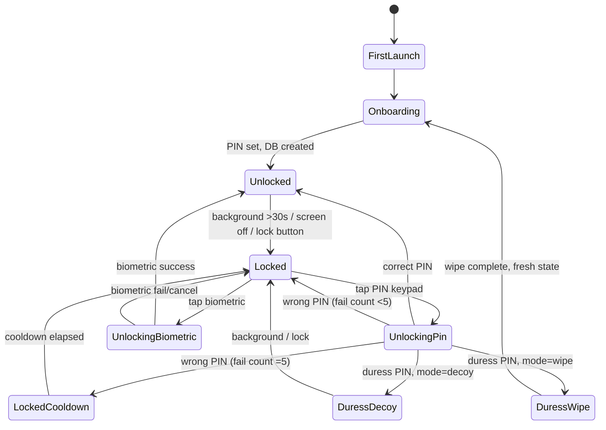

# Tides — Offline Period Tracker Design Spec

**Status:** Draft for user review — v1.1
**Date:** 2026-05-15
**Author:** hayate0726
**Working name:** Tides (ambiguous on home screen — does not out the user)
**Revision history:**
- v1.0 (2026-05-15) — initial spec
- v1.1 (2026-05-15) — pre-mortem revisions: threat-model presets, calendar view toggles, curated symptom taxonomy, FIGO-aligned doctor PDF, one-tap share, monthly insights card, notifications design, F-Droid + Obtainium distribution commitment

---

## 1. Purpose and goals

Tides is an offline-first Android period tracker, distributed as a signed APK from GitHub Releases, free forever, with an optional in-app donation link. The product is mission-driven, not commercial: it exists because the post-Dobbs paid/free privacy-focused tracker market is dominated by either trackers that quietly ship data to analytics SDKs (Stardust, Flo) or open-source utilitarian projects with significant UX gaps (Drip, Euki, Periodical).

**Primary goal:** ship a polished, genuinely-offline tracker that a non-technical user can sideload and use without their cycle data ever leaving their phone.

**Audience:**
- **Primary:** Privacy-maximalist users who already sideload apps (small, loyal, will find the app organically).
- **Secondary:** Post-Dobbs users worried about reproductive data being subpoenaed (larger; sideloading is friction, so onboarding must be polished enough to retain them).

**Non-goals:**
- iOS support (Apple Guideline 5.2.1 blocks solo developers from health-category apps; sideloading is not realistically possible without jailbreaking).
- Cloud sync, accounts, telemetry, A/B testing, remote config — all explicitly forbidden by the threat model.
- Venture-scale growth. Realistic donation revenue is $0–200/month.

---

## 2. Tech stack and platform

- **Language:** Kotlin
- **UI:** Jetpack Compose with Material 3 (expressive)
- **Min SDK:** Android 8 (API 26) — covers ~96% of active devices, supports modern crypto + BiometricPrompt
- **Target SDK:** Android 14 (API 34)
- **Build system:** Gradle (Kotlin DSL)
- **DI:** Hilt
- **Navigation:** Compose Navigation, single Activity
- **Distribution:** Signed release APK on GitHub Releases. F-Droid metadata included for optional listing.
- **License:** GPL-3.0 (prevents tracker-injected forks; F-Droid-compatible)

**Required runtime permissions:**
- `USE_BIOMETRIC` — biometric unlock
- `VIBRATE` — haptic feedback on PIN entry
- `POST_NOTIFICATIONS` — local-only reminders (opt-in, default off)

**Permissions explicitly *not* requested:**
- `INTERNET` — the manifest does not declare it. The app cannot make a network call even if a future bug tried to.
- No background services, no boot receiver, no scheduled jobs.

---

## 3. Architecture and module boundaries

Single Gradle module with package-level boundaries:

```
com.hayate0726.tides/
├── crypto/          # Argon2id, key derivation, Keystore wrapping. NO dependencies on other packages.
├── data/            # Room entities, DAOs, SQLCipher integration. Depends on crypto.
├── domain/          # Pure Kotlin business logic: cycle prediction, fertile window, phase math, stats. No Android deps.
├── ui/              # Compose screens, ViewModels. Depends on domain + data.
│   ├── lock/        # PIN entry, biometric prompt, duress detection
│   ├── calendar/    # Cycle calendar view, logging
│   ├── log/         # Bottom-sheet log entry
│   ├── stats/       # Insights, charts, exports
│   ├── onboarding/  # Goal-picker, PIN setup, biometric setup, BC method, first period
│   ├── settings/    # All settings including duress config, theme, feedback
│   └── export/      # PDF report + encrypted backup
├── widget/          # Glance widget. Depends on read-only summary file only.
└── app/             # Application class, navigation, DI wiring
```

**Why these boundaries:**

- `crypto/` has zero outward dependencies. It is the only package that touches raw key material. It can be audited in isolation.
- `domain/` is pure Kotlin (no Android, no Room, no Compose). Cycle prediction logic is unit-testable on the JVM in milliseconds — no instrumented tests needed for the math.
- `widget/` is read-only by design. It reads from a small unencrypted summary file (cycle day number, predicted-period date only — nothing identifying). It cannot read the encrypted DB because the widget runs without a user-authenticated context.

**State management:** Compose + ViewModel + StateFlow. No Redux/MVI framework — overkill for this scope.

**Lock state:** A top-level `LockManager` gates the nav graph. Locking clears the nav stack, zeroes the in-memory key, and shows the unlock screen. Lock triggers: app backgrounded for >30 seconds, screen off, explicit lock button in app bar.

---

## 4. Data model and encryption

### Storage

- **Database:** Room (SQLite) with SQLCipher for transparent full-database encryption.
- **Schema (entities):**
  - `cycle_entries` — `date`, `flow_intensity` (0=none, 1=spotting, 2=light, 3=medium, 4=heavy), `pain_severity` (0–10 NRS, nullable; surfaces in doctor PDF as dysmenorrhea severity), `notes` (nullable)
  - `symptom_entries` — `date`, `symptom_type` (enum from curated taxonomy below; `OTHER` for user-entered free text), `severity` (0–2: mild/moderate/severe), `other_text` (nullable, only populated when `symptom_type == OTHER`)
  - `birth_control` — `method` (none/pill/hormonal-iud/copper-iud/implant/patch/ring/other), `start_date`, `end_date` (nullable, for tracking method changes over time)
  - `settings` — key/value: `theme`, `accent_color`, `week_start`, `threat_preset` (just_for_me/locked_when_away/always_locked), `duress_mode` (off/decoy/wipe), `show_phases`, `bc_method`, `calendar_view` (all/period_only/phases/symptoms), etc.
  - `goals` — onboarding goal selections (drives which features appear)

**Curated symptom taxonomy.** Symptoms ship as a fixed enum so the data is analyzable across cycles. Categories (each symptom is a discrete enum value, severity is 0–2):

- **Pain:** cramps, headache, migraine, back pain, breast tenderness, joint pain, abdominal pain
- **Mood:** anxious, irritable, sad, happy, sensitive, calm
- **Energy:** tired, energetic, restless, foggy
- **Body:** bloating, acne, hot flashes, chills, dizziness, nausea, vomiting
- **Digestive:** constipation, diarrhea, gas, increased appetite, decreased appetite, cravings
- **Sleep:** insomnia, oversleeping, vivid dreams, night sweats
- **Discharge:** dry, sticky, creamy, watery, egg-white, brown, spotting
- **Sex:** high libido, low libido, painful sex
- **Other (note):** free-text escape hatch. Stored but excluded from frequency stats and from the doctor-PDF "Patterns of note" section. Surfaces as a list of notes in the doctor PDF appendix only.

Custom user-defined symptoms are **not supported** as enum values. The "Other (note)" symptom keeps power users from feeling boxed out while keeping aggregate analytics clean.

### Encryption key flow

```mermaid
sequenceDiagram
    autonumber
    participant U as User
    participant UI as Lock UI
    participant C as crypto/
    participant K as Android Keystore
    participant DB as SQLCipher DB

    Note over U,DB: First launch — PIN setup
    U->>UI: Enter PIN (≥6 digits)
    UI->>C: derive_key(pin, fresh_salt)
    C->>C: Argon2id(64MiB, 3 iter)
    C-->>UI: db_key
    UI->>DB: create(db_key)
    DB-->>UI: empty encrypted DB
    UI->>C: store_pin_hash(Argon2id(pin, hash_salt))
    UI->>UI: zero(pin)
    Note over U,DB: Optional: enable biometric
    U->>UI: Enable biometric
    UI->>K: wrap(db_key, biometric-bound key)
    K-->>UI: wrapped_db_key
    UI->>C: zero(db_key) [keep wrapped form only]

    Note over U,DB: Subsequent unlock — PIN
    U->>UI: Enter PIN
    UI->>C: derive_key(pin, stored_salt)
    C-->>UI: db_key candidate
    UI->>DB: open(db_key)
    alt success
        DB-->>UI: unlocked
    else fail
        UI->>UI: increment fail count, possibly cooldown
    end
    UI->>UI: zero(pin)

    Note over U,DB: Unlock — biometric
    U->>UI: Tap biometric prompt
    UI->>K: unwrap(wrapped_db_key) [biometric required]
    K-->>UI: db_key
    UI->>DB: open(db_key)
    DB-->>UI: unlocked

    Note over U,DB: Lock event
    UI->>DB: close()
    UI->>C: zero(db_key) [in-memory only; Keystore copy persists if biometric enabled]
```

**Key derivation parameters:** Argon2id with memory = 64 MiB, iterations = 3, parallelism = 1. Produces a 32-byte key. ~300–500ms unlock latency on a midrange Android phone (acceptable; unlocks are infrequent).

**Auth metadata storage (`auth_meta.bin`):** Random 16-byte salts (one for PIN-to-key derivation, one for PIN hash, plus the same pair for the duress PIN if configured), Argon2id hashes of both PINs (used to validate the PIN before attempting DB unlock — lets us detect wrong PIN without trying to open SQLCipher, which is slower to fail), fail count, and cooldown expiry timestamp. Persisting cooldown state here means rate-limiting survives app kills.

**Files on disk:**
- `cycles.db` — encrypted SQLCipher DB (real data)
- `decoy.db` — encrypted SQLCipher DB (decoy data, only exists if `duress_mode == decoy`)
- `auth_meta.bin` — Argon2 salts (primary + duress), PIN hashes, fail count, and cooldown expiry timestamp. Not sensitive on its own (no key material, no cycle data).
- `widget_summary.bin` — small unencrypted file containing only what's already visible on the widget (cycle day number, predicted-period date). Documented tradeoff; user can disable widget to remove this file entirely.

**Forbidden:**
- No `SharedPreferences` for any cycle/symptom/PIN-related data.
- No logging of cycle data, symptom data, notes, or anything user-entered. Lint rule + test grep-checks Logcat.
- No crash reporting service, no analytics SDK.
- No file other than the four above. CI tests verify only these files exist after running through a synthetic user session.

### Duress PIN

A second PIN hash is stored alongside the primary. On every unlock attempt, both hashes are checked. Match on primary → normal unlock. Match on duress → behavior depends on user setting:

- **Decoy mode (`duress_mode == decoy`):** load `decoy.db` instead of `cycles.db`. The decoy DB is created at duress-PIN setup time and contains plausibly-old generic data (one or two cycles, no symptoms, no notes). The UI is identical to a real unlock — same screens, same theme.
- **Panic-wipe mode (`duress_mode == wipe`):** zero the in-memory key, delete `cycles.db`, delete `decoy.db` (if present), re-initialize an empty DB with the duress PIN as the primary PIN. Navigate to the onboarding screen as if fresh-installed. User loses their data; the attacker sees "she never used it."

**Both modes must produce a UI indistinguishable from a successful unlock to a fresh observer.** This is a test requirement, not just a design goal.

### Invariants (these become test assertions)

1. The DB key never persists to disk in unwrapped form. Anything on disk is either Argon2 input/output (the salts and PIN hashes) or Keystore-wrapped.
2. The DB key never appears in logs, prefs, intents, or files outside the four named above.
3. The DB key is zeroed in memory within 100ms of any lock event (app backgrounded, screen off, lock button).
4. The PIN is zeroed in memory within 100ms of any unlock attempt (success or fail).
5. The app cannot make a network call: the manifest does not declare `INTERNET`. Static analysis enforces this in CI.
6. There is no "forgot PIN" recovery flow. Lost PIN = lost data. This is documented in the privacy summary and in onboarding.

---

## 5. Core user flows

### 5.1 First-launch onboarding

Six steps, each on its own screen. Step 1 is fixed; subsequent steps are partly conditional on step 2 answers.

1. **Welcome + privacy promise.** One paragraph: "Your data never leaves this phone. There is no account. No one — including the developer — can see what you log." "Continue" button.
2. **Goal picker (multi-select).** Options: Track period, Track symptoms, Manage a condition (PCOS / endometriosis / perimenopause), Avoid pregnancy *(shows ovulation window — not for contraception)*, Trying to conceive, Just curious. The selection set drives which features appear. Default selected: Track period + Track symptoms.
3. **Set PIN.** 6-digit minimum. "Use passphrase instead" link toggles to an alphanumeric input. Confirm by re-entry. Lost-PIN warning shown in plain language. **PIN is always set, even in "Just for me" mode** — the database is encrypted with it regardless of how often it's required to unlock.
4. **Enable biometric?** Optional toggle. Default on if device supports it; explanation: "Faster unlock. Your PIN is still required to recover if biometric fails."
5. **Privacy preset (threat model picker).** Three options shown as cards. Default selected: "Locked when away."
   - **Just for me** — *No lock screen. Anyone with your phone can open the app.* (Database is still encrypted with PIN; PIN required when changing presets or via explicit lock button.)
   - ⭐ **Locked when away** — *Recommended. PIN required after 5 minutes of background. Quick to unlock.* Lock-screen notification previews suppressed; notification title is "Reminder."
   - **Always locked** — *Maximum privacy. PIN every 30 seconds. Optional panic features.* Notifications fully suppressible; lock screen shows only the wordmark; duress PIN available in Settings.
   - Caption beneath: "You can change this anytime in Settings."
6. **Last period date** (skippable). Single date picker. Skipping means predictions start later, once enough cycles are logged. **Birth control method** is asked here too only if step 2 included "Avoid pregnancy" or "Trying to conceive" or "Just curious" — and is itself skippable.

Onboarding decision logic (prose, not diagram):

- If goal includes "Track period" or "Just curious" → ask last period date.
- If goal includes "Manage a condition" → at first cycle screen, show a one-time inline tip about logging irregular cycles.
- If goal does NOT include "Avoid pregnancy" or "Trying to conceive" → ovulation/fertile-window UI is suppressed everywhere (calendar, stats, widget). User can re-enable in Settings.
- If birth control method is hormonal (pill, hormonal IUD, implant, patch, ring) → ovulation/fertile-window UI is suppressed regardless of goals (honest behavior: hormonal methods make these meaningless).

**Duress PIN is NOT in onboarding.** It is opt-in via Settings, with its own explainer screen. Reason: introducing it to a first-time user creates anxiety and slows onboarding; users who need it will find it.

### 5.2 Daily logging (the 80% flow)

- Open app → biometric/PIN unlock → Calendar screen (current month, today highlighted, current cycle day prominent)
- Tap today (or any other day) → bottom sheet slides up
- Bottom sheet contains:
  - Flow intensity (5 horizontal pill buttons: None, Spotting, Light, Medium, Heavy; intensity also encoded by count of drop glyphs — CVD-safe)
  - Symptoms (scrollable list of toggleable chips; selected chips get a severity badge with mild/moderate/severe; "+ Add" appends a custom symptom)
  - Note (optional free-text)
  - Cancel / Save
- Two taps minimum to log a period (tap day → tap flow → save is technically three, but flow defaults to last-used so existing users get a two-tap flow on the next period day).

### 5.3 Lock and unlock

Behavior depends on the user's threat-model preset (set in onboarding §5.1 step 5, editable in Settings).

**Preset → behavior mapping:**

| Setting | Just for me | Locked when away (default) | Always locked |
|---|---|---|---|
| Lock screen on app open | No (skip) | Yes if backgrounded ≥5 min | Yes if backgrounded ≥30s |
| Biometric option | Available, optional | Available, on by default | Available, on by default |
| Lock-screen notification preview | Visible | Suppressed | Suppressed |
| Notification default title | "Tides" | "Reminder" | "Reminder" |
| Duress PIN available | No | No | Yes (opt-in in Settings) |
| Lock button in app bar | Yes (manual lock) | Yes | Yes |

**Universal behavior (all presets):**

- The database is always encrypted with the PIN-derived key. The preset only changes *when* the unlock screen appears, not whether the data is encrypted.
- Under **"Just for me"**, the derived key is stored in Keystore (non-biometric-bound; protected only by app-private storage and Android's per-app sandboxing) so the app can open the DB at launch without prompting. This is *less secure* than the locked presets but the user has explicitly accepted that tradeoff. The Keystore copy is wiped when the user upgrades to a locked preset or explicitly locks the app.
- Explicit lock button in the app bar always works regardless of preset.
- Changing the preset requires PIN entry (prevents an attacker who has the phone from dropping to "Just for me").
- PIN entry has haptic feedback per digit, error shake on wrong PIN.
- **Rate-limit:** 5 wrong attempts → 30-second cooldown. Each subsequent batch doubles (30s, 60s, 120s, 240s, capped at 1 hour). Cooldown is enforced even if app is killed and relaunched (stored in `auth_meta.bin`).
- **Duress PIN** (only available under "Always locked" preset): entered identically to the real PIN; routes to decoy or wipe based on user's `duress_mode` setting; UI flow is identical to a successful unlock until the user notices the data is different (decoy mode) or until they realize their data is gone (wipe mode).

### 5.4 Lock state machine



### 5.5 Phases, predictions, and calendar view toggles

For users with non-hormonal birth control (or "none") and goals that include period tracking:

- Four named phases: Menstrual, Follicular, Ovulation, Luteal. Displayed in the phase card on the Calendar screen with a four-segment progress bar.
- Phase boundaries are calculated from the user's median cycle length (over the last 6 cycles, or whatever is available). They are explicitly labeled "likely" — the phase card says "Ovulation **likely**" not "Ovulation."
- Predicted period is displayed as a **range band** under the calendar (e.g., May 28 – Jun 1), not a single date. Band width reflects confidence: narrow for users with regular cycles (<2 day variance), wider for irregular.
- **Suppressed entirely** if the user is on hormonal contraception or the goal set doesn't include period/fertility tracking.

**Calendar view toggles.** A small chip row above the calendar lets the user filter what they see:

- **All** (default) — period circles + ovulation rings + symptom dots + predicted period bar + phase progress card
- **Period only** — period circles + predicted period bar; phase card collapses; ovulation and symptom indicators hidden
- **Phases** — phase progress card prominent; calendar cells get subtle phase-colored backgrounds; period circles still shown; symptom dots hidden
- **Symptoms** — symptom dots prominent; period and ovulation faded to background; useful for users tracking symptoms across cycles

The selected view persists in `settings.calendar_view`. The toggle row uses text chips with selected-state ink, not color-only.

### 5.6 Stats / Insights

**Core stats** (always visible):
- Range selector (3mo, 6mo, 1yr, All)
- Two summary cards: avg cycle length (with variance), avg period length (stable/varying)
- Bar chart: cycle length over last N cycles
- Top symptoms list: bar chart of frequency, top 4–6 symptoms
- Export buttons: PDF, CSV (one-tap share — see §5.7)

**Additional analyses** (revealed via tabs or expandable sections to avoid clutter):

- **Symptom-cycle heatmap.** For each tracked symptom, a heatmap shows on which cycle days that symptom is typically logged across the last N cycles. Helps users see patterns ("cramps days 1–2," "headache around ovulation").
- **Cycle regularity score** — plain language ("very regular" / "moderately variable" / "highly variable") with the day-variance number alongside for users who want it. FIGO-aligned (variation ≤7 days = regular).
- **Period length trend** — "Your period has been getting shorter / longer / staying stable" with a sparkline.
- **Flow heaviness over time** — sparkline of dominant flow intensity per cycle.
- **"What does this mean?"** info button on each stat — tap to see a plain-language explanation. No medical advice; just context (e.g., "FIGO defines a cycle as irregular if shortest-to-longest varies by more than 7 days").

**Monthly insights card.** Once per new cycle (i.e., at most monthly), a single subtle card appears at the top of the Stats screen surfacing one reflective observation drawn from the user's own data. Examples:
- "Your cycles have been more regular in the last 3 months."
- "Cramps are most commonly logged on days 1–2 of your period."
- "Your typical cycle length is now 29 days, slightly longer than 6 months ago."

The card is dismissible. It is **never** in notifications, never on the calendar screen, never frames predictions about future state ("you'll probably feel X"). All observations are derived on-device from the user's logged data. No "users like you" framing.

**Explicitly excluded:**
- Streaks, daily logging prompts, "you logged X days in a row" — research-contraindicated.
- Predictive labels about mood, fertility outcomes, libido, energy.
- Any framing that suggests medical interpretation ("your cycles suggest…").

### 5.7 PDF / CSV export — one-tap share

The export flow generates a file in-memory and immediately fires `Intent.ACTION_SEND` with a share sheet. One tap, system share UI, user picks email / Signal / Files app / print / anything. Same flow for PDF and CSV. "Save to a specific location" is available via long-press for users who want it but is not the default action.

**Two PDF variants:**

**1. Cycle Summary (default).** Report-card style for personal use.
- Title: "Cycle Summary — [date range]"
- Header: averages, variance, top symptoms
- Body: simple table of cycles (start date, length, period length, notable symptoms)
- Footer: "Generated by Tides vX.Y.Z. Not a medical document. Do not use for diagnosis."

**2. For My Doctor.** Clinician-formatted, FIGO-aligned (researched 2026-05-15 against ACOG Committee Opinion #651, FIGO System 1 [Munro 2018/2022], NICE NG88, GLOWM gynecologic history).

- **Format constraints:** PDF/A, single file, <2 MB. US Letter + A4 portrait, single column, 11–12 pt minimum, black on white only (no light grey decorative text — must remain readable when printed or photocopied). No JavaScript, no hyperlinks. Target 2 pages; hard cap 4 pages.

- **Page 1 — Summary (the only page many clinicians will read):**
  - Header: "Menstrual Tracking Summary" • optional user name • optional date of birth • date range covered • date generated
  - **LMP** (first day of last menstrual period) prominently displayed
  - **Cycle stats box:** median length, min–max range, variation (days), # cycles tracked
  - **Period stats box:** median duration, typical flow (using FIGO terminology), % cycles with heavy flow
  - **Symptoms summary:** % of cycles with dysmenorrhea (severity 0–10 NRS), intermenstrual bleeding count, other tracked symptoms with frequency
  - **Patterns of note** — auto-flagged using FIGO thresholds, *descriptive language only*. Examples:
    - "Cycles outside the typical 24–38 day range (FIGO)"
    - "Variation greater than 7 days (FIGO irregular)"
    - "Period duration exceeded 8 days in N of M cycles (FIGO prolonged)"
    - "Intermenstrual bleeding logged in N cycles"
    - "Severe dysmenorrhea (≥7/10) logged in N cycles"
    - "Amenorrhea ≥90 days"
  - Footer: "Patient-recorded data. Not a medical record. Not medical advice."

- **Page 2 — Cycle log table.** One row per cycle. Columns: start date, length (days), period duration (days), flow (FIGO term), pain (0–10), symptoms/notes. **Rows where FIGO thresholds are crossed are bolded** (no color-only signal — readable when printed or photocopied).

- **Page 3 (optional, toggled at export time) — Calendar heatmap** of last 6–12 months. Black/white only. Period days, spotting, pain intensity by shade.

- **Sensitive content opt-ins at export time** (checkboxes, all default off):
  - Include name and date of birth
  - Include sexual activity / contraception details
  - Include calendar heatmap (page 3)

- **What this PDF deliberately does NOT contain:**
  - No app-generated diagnoses or risk labels ("you may have PCOS")
  - No fertility window or ovulation predictions framed as fact (if shown at all, labeled clearly as algorithmic estimate)
  - No decorative graphics, mood emojis, or app branding in the body
  - No fake patient ID, ICD codes, or clinician signature blocks (would create chart-confusion and liability)

Both variants generated using Android's built-in `PdfDocument` API — no third-party PDF library. Generation happens entirely on-device.

### 5.8 Encrypted backup and restore

- Settings → Back up data → user picks a backup password (can be the same as PIN if they want) → SAF picker to choose location → writes `.tides-backup` file (SQLCipher format with the backup password as the key).
- Settings → Restore data → SAF picker → backup password prompt → confirm overwrite of current data → done.
- File format is the same SQLCipher DB format, so restore code is minimal.

### 5.9 Donation

- Settings → "Support development" → small explainer ("This app is free forever. Donations help me keep building.") → buttons for Ko-fi and GitHub Sponsors → each fires `Intent.ACTION_VIEW` to that URL.
- **Ko-fi destination:** `https://ko-fi.com/hayate0726`
- GitHub Sponsors destination: TBD (set up if/when needed; Ko-fi alone is sufficient for v1).
- Never nagged, never on the main screen, never a popup.

### 5.10 Feedback

Two channels, presented as a choice on the feedback screen so users can pick the right one for their situation.

**Settings → "Send feedback"** opens a screen with two options:

**1. Report a bug (public)** — opens `Intent.ACTION_VIEW` to a pre-filled GitHub Issues URL:
`https://github.com/hayate0726/tides/issues/new?labels=feedback&template=feedback.yml&...`
- Pre-fills title and body with optional diagnostic info if the user checked "Include diagnostic info."
- Requires the user to have (or create) a GitHub account.
- Public by design — visible to other users, useful for deduplication and community knowledge.
- **Best for:** crashes, UI bugs, feature requests, anything where being public is fine.

**2. Send private feedback (email)** — opens `Intent.ACTION_SENDTO` with `mailto:0726hayate@gmail.com`:
- Pre-fills subject and body with optional diagnostic info.
- Goes to a dedicated inbox the developer monitors.
- **Best for:** sensitive feedback, privacy concerns, anything the user doesn't want to be public.

**Shared behavior (both channels):**

- The compose screen offers an "Include diagnostic info" checkbox.
- Diagnostic info, if checked, appends only: app version, Android version, device model, locale, theme, last 5 non-fatal errors (truncated).
- **Never included:** cycle data, symptom data, notes, PIN, BC method, dates of entries.
- The app constructs the URL/intent locally with the user's typed message; the user reviews the full content in their browser (GitHub) or email app before submitting/sending. The app itself sends nothing.

### 5.11 Update check

- No INTERNET permission → no auto-check.
- Settings → "Check for updates" → `Intent.ACTION_VIEW` to GitHub Releases page.
- README recommends Obtainium for users who want automatic update checking.

### 5.12 Notifications

All notifications are **opt-in, individually toggleable in Settings, and strictly factual in copy**. Default notification title is **"Reminder"** (under "Locked when away" and "Always locked" presets) or **"Tides"** (under "Just for me" preset). Lock-screen previews are suppressed by default under both locked presets.

**Notification types shipped in v1:**

- **Period predicted.** "Period predicted in 3 days." Sent 3 days before the predicted period start. Once per cycle. Default off — user opts in.
- **Period start reminder.** "Time to log? Period predicted today." Sent on the predicted start date *only* if the user hasn't logged a period within the predicted range. Once per cycle. Default off.
- **Late period.** "Your period is 3 days later than predicted." Sent only if predicted + 3 days have passed with no period logged. Once per cycle. Default off. Copy is strictly neutral — never mentions pregnancy, never alarmist.

**Explicitly excluded:**

- Daily symptom logging prompts (off by default; users who want them can opt in)
- Streak notifications, "you logged X days in a row" reminders
- Any notification referencing libido, mood, hormones, or sexual activity
- Any notification framed as the app *predicting* the user's emotional state

**Lock-screen behavior:**

- Under "Locked when away" and "Always locked" presets, notifications show only the title (default "Reminder") on the lock screen. Full notification text is visible only after unlock.
- Under "Just for me" preset, notifications show full text on the lock screen by default; user can override in Settings.

### 5.13 Widget

- Read-only home-screen widget (Glance API).
- Two variants user picks at install:
  - **Normal:** shows current cycle day and predicted-period date.
  - **Discreet:** shows a generic calendar icon and a small number; never displays the word "period."
- Reads from `widget_summary.bin`, which contains only the data already shown on the widget. The user can disable the widget entirely for maximum privacy.

---

## 6. UI / UX design direction

### Aesthetic

"Design-led privacy." Material 3 expressive, typographic-led, restrained. Closer in spirit to Things 3 / Linear / Arc Browser than to wellness apps. No mascots, no illustrations, no wellness copy.

### Color

- **Light theme (default):** Cream/clay palette (Material You–adjacent). Background `#faf5ec`, surface `#ebe1cc`, ink `#1d1b16`, muted ink `#6b6354`. Single accent: a muted clay-red `#c25a3a` used only for period days and the FAB.
- **Dark theme:** True OLED. Background `#0a0a0a`, ink `#fafafa`, muted ink `#71717a`. Accent: a slightly more muted red `#b8413a` for period days. Wordmark white-on-black.
- **Material You dynamic color** is enabled by default in Settings — the app picks up the user's wallpaper palette. Falls back to the cream/clay palette if dynamic color is unavailable.
- **User can override** the accent (rust, sage, slate, plum) in Settings. Default behavior is the cream/clay palette in light + monochrome in dark.

### Typography

- One sans-serif used at varied weights/sizes. **Google Sans / Roboto** on light theme (Material-native), **Inter** on dark theme (slightly tighter feel that suits the monochrome aesthetic). Display weights for headers; book weights for body.
- No decorative or serif fonts (deliberate departure from the warm-privacy mockup direction — research showed serif risk of feeling pretentious for a utility app).

### Color vision deficiency (CVD) accommodations

All cycle-relevant UI elements use **shape + value + color**, never color alone. This is non-negotiable.

- **Period days:** filled circle (color) + small drop glyph in the corner (shape). Glyph is white on the colored fill.
- **Today:** solid black filled circle (high-contrast value, never red).
- **Ovulation window:** outlined circle (shape) + small diamond glyph (shape). Color is the same ink as the date number.
- **Predicted period:** a labeled dashed bar drawn *underneath* the calendar row (structural difference from day circles — never confusable regardless of color rendering). Label reads "PREDICTED PERIOD."
- **Symptom logged:** small neutral grey dot below the date (color-neutral; safe under all CVD types).
- **Flow intensity:** count of drop glyphs encodes intensity (Spotting = 1, Light = 1, Medium = 2, Heavy = 3) — duplicated by text label.
- **Phase progress bar:** colors plus position. The active phase is bolded in the legend below.
- **Severity badges** ("mild," "moderate," "severe") are text, never color-coded sliders alone.
- **Settings → High-contrast mode** toggle: bumps the period red to a darker shade with higher value contrast, beefs up the drop glyph, makes the predicted bar thicker.

### CVD test gate

Pre-release QA includes running the four CVD simulator screenshots (deuteranopia, protanopia, tritanopia, monochromacy) on every primary screen. Any screen where period vs. predicted vs. ovulation are not distinguishable without color is a release blocker.

### Tone and language

- **Gender-neutral copy throughout.** "You" not "she" / "girl" / "woman." App name is non-gendered.
- **Factual notifications only.** "Period predicted in 3 days." Never "Feeling frisky today?" or hormone/libido references.
- **Lock-screen notification preview:** never shows the word "period." Default title is "Reminder."
- **No streaks, no daily nag notifications, no gamification anywhere.** Research-contraindicated for users experiencing loss or infertility.
- **Predictions are always qualified.** "Period likely May 28–Jun 1." "Ovulation likely." Never "Period: May 28."

### Accessibility

- All controls labeled for TalkBack.
- Minimum touch target 48dp.
- Dynamic font scaling respected up to 200%.
- Tested in landscape and tablet sizes.
- Color is never the only signal (covered by CVD section above).

### Reference mockups

See [mockups/](../mockups/) directory for rendered screenshots of:
- Calendar light + dark (with phase progress and ovulation window)
- Log bottom sheet
- Stats/Insights
- Lock screen
- Onboarding goal picker
- CVD simulations for all primary screens

---

## 7. Testing strategy

### Test pyramid (rough, not gospel)

- **~70% unit tests** (JVM-only, no Android): `domain/` cycle math, `crypto/` key derivation, pure Kotlin logic
- **~20% integration tests** (Robolectric where possible, instrumented otherwise): `data/` Room+SQLCipher roundtrip, backup format, onboarding decision tree
- **~10% UI tests** (Compose UI testing): lock screen flows, onboarding paths, calendar logging round-trip

### Security-critical test requirements (release blockers)

1. The DB key is never written to disk unwrapped — test grep-checks app-private files for known key bytes after unlock.
2. Wrong PIN never unlocks — brute-force test with 1000 random wrong PINs.
3. Duress PIN routes correctly — decoy mode loads decoy DB; wipe mode deletes and re-inits.
4. Both duress modes are UI-indistinguishable from real unlock to a fresh observer.
5. Rate-limit holds — 5 wrong attempts triggers cooldown; attempts during cooldown never validate.
6. No INTERNET permission — static analysis on the built APK fails the build if it appears.
7. Backup is decryptable only with the right password — round-trip with right password succeeds; wrong password fails cleanly without partial data leak.
8. Logs are clean — synthetic-user session grep-checks Logcat for any cycle/symptom/PIN data; must be empty.
9. Memory zeroing — after lock, process memory regions are checked for residual key bytes (best-effort under JVM constraints).

### Coverage targets

- `domain/`: 90%+ line coverage
- `crypto/`: 100% line coverage on key derivation paths
- `data/`: 80%+
- `ui/`: no hard target; focus on critical-path UI tests

Coverage reported in CI; failing PRs only on a *drop* from main, not on absolute number.

### Static checks (every PR)

- Detekt (Kotlin lint, strict ruleset, no warnings allowed)
- ktlint (formatting, auto-fixed on commit hook)
- Android Lint (no errors, no severity-high warnings)
- Dependency check (fail if any dep requests INTERNET transitively)
- License check (fail if any GPL-incompatible license appears)

### CVD test gate

CVD screenshots regenerated on any change to calendar/stats/log/widget UI. Manual review before release.

---

## 8. Distribution and install

The app is never published to Google Play. Distribution is via signed APK on GitHub Releases, with two third-party auto-update paths supported as v1.0 commitments.

### Channels

- **GitHub Releases (primary).** Signed APK attached to each release. README provides SHA-256 hash for manual verification. Release notes pulled from CHANGELOG.md.
- **F-Droid (v1.0 commitment).** F-Droid metadata maintained in `fastlane/metadata/android/` per the F-Droid client spec. Initial submission via merge request to the F-Droid Data repo within 2 weeks of v1.0 ship. F-Droid handles its own signing and provides automatic updates to users who install via the F-Droid client. Reaches the privacy-maximalist audience natively (F-Droid is the canonical sideload store for that demographic).
- **Obtainium (recipe in README).** README provides a copy-pasteable Obtainium config (GitHub repo URL + APK pattern) so users running Obtainium get automatic update checks against GitHub Releases without the developer running any infrastructure.

### Install guide (README content)

The README includes:
- **Recommended install paths in order of friction:**
  1. F-Droid client → search "Tides" → install
  2. Obtainium → paste GitHub URL → install
  3. Manual APK download from GitHub Releases
- **Step-by-step "Install from unknown sources" walkthrough** for manual install, with screenshots covering Android 14+'s per-app source toggle and security warnings.
- **30-second install video** linked in README (no autoplay; static thumbnail).
- **SHA-256 verification instructions** for users who want to verify the APK signature before installing.

### Why this matters

Sideloading is the single highest-friction step in the user funnel. The combination of F-Droid + Obtainium covers ~80% of users who would otherwise abandon during install. Manual APK install with screenshots covers the remaining users who lack either tool.

## 9. Release process

- **Versioning:** Semver. Major = breaking schema change. Minor = new feature. Patch = bug fix.
- **Branch model:** main is releasable. Feature branches → PR → squash-merge.
- **Changelog:** `CHANGELOG.md` maintained manually as part of release PR. Includes a "Privacy/security changes" section that is explicitly empty if nothing changed in that area (absence is visible).
- **Signing:** Single release keystore. Password stored securely (1Password or equivalent), never in repo. Keystore backed up to encrypted offline storage immediately after generation. Lost keystore = users can't auto-update.
- **CI on PR:** build → unit tests → lint + static checks → APK permission audit → integration tests → coverage report on PR.
- **CI on tag push (v*.*.*)**: all PR steps → build signed release APK → generate SHA-256 → create GitHub Release with APK + signature + auto-generated changelog → push F-Droid metadata update if listing is live.
- **Release artifact:** APK on GitHub Release. README publishes:
  - SHA-256 for verification
  - Recommended install paths: Obtainium (auto-update), F-Droid (once listed), manual sideload
  - "Install from unknown sources" step-by-step guide

### Definition of done for a feature

1. Implementation exists.
2. Unit tests cover happy path + at least one edge case.
3. If it touches data or crypto, integration test exists.
4. If it touches lock/security, the relevant test from §7 passes.
5. Lint + detekt clean.
6. Manually exercised on a real device or emulator.
7. `CHANGELOG.md` updated under the appropriate section.
8. PR merged to main.

---

## 10. Out of scope (deferred to v2 or never)

- **iOS support.** Apple 5.2.1 + no sideloading = not a solo-dev project. Never.
- **Pregnancy mode.** Complex state transitions (loss, termination, postpartum); high risk of getting wrong; deferred to v2 after user feedback.
- **Stealth mode (disguised icon).** Adds ~1 week to v1 timeline to do correctly (launcher cache, recents screen, accessibility tree all need to be considered). Flagged in v1.1 as a v2 commitment, not v1.
- **Custom user-defined symptoms (free-form).** v1.1 decision: ship a curated taxonomy plus an "Other (note)" escape hatch. Free-form custom symptoms would fragment the data and break aggregate analytics. Not planned.
- **Apple Watch / wearable integration.** No iOS, and Wear OS is a separate UI surface — defer.
- **Cloud sync (any flavor).** Forbidden by threat model. User-controlled file backup via SAF is the supported pattern. Never.
- **Partner sharing.** Privacy implications, key management complexity. v1.1 decision: not pursuing.
- **Pill reminder / contraception tracking.** Out of scope; competes with dedicated apps.
- **Telemetry, A/B testing, remote config.** Forbidden by threat model. Never.
- **In-app INTERNET permission.** v1.1 decision: locked out. Updates flow through F-Droid client / Obtainium / user-initiated browser visit to GitHub Releases. The app's manifest does not declare INTERNET. Never.
- **EHR / patient portal direct integration** (Epic MyChart, Cerner, etc.). PDF export via system share sheet is the supported path.

---

## 11. Open questions and known risks

1. **External endpoints (resolved).** Ko-fi donation page: https://ko-fi.com/hayate0726. Feedback email: 0726hayate@gmail.com. Bug reports: GitHub Issues (`hayate0726/tides`). GitHub Sponsors not planned for v1.
2. **"Other (note)" symptom storage.** Free-text notes attached to the OTHER symptom type could contain sensitive information; they are stored encrypted in the same SQLCipher database as all other data. Excluded from frequency analytics; surface in doctor PDF appendix only. No special handling required, but flagged.
3. **Keystore lost on factory reset / device migration.** Biometric-bound keys do not survive device migration. Users restoring on a new device must re-enter PIN; the wrapped key in the old Keystore is gone. This is acceptable and matches user expectation; flagged for the privacy README.
4. **Predictions during the first 2 cycles.** Insufficient data for meaningful prediction. App displays "Logging more cycles will improve predictions" instead of showing a range.
5. **PCOS / very irregular cycles.** The simple median-based prediction may produce unhelpful results for users with high variance. Mitigation: show wider range bands, surface variance in the stats screen, and offer to suppress prediction entirely in Settings.
6. **Donation revenue is realistically near-zero.** Tradeoff already accepted: this is a mission project, not a business.

---

## 12. Approval

Author: hayate0726
Approved by user: _pending_
